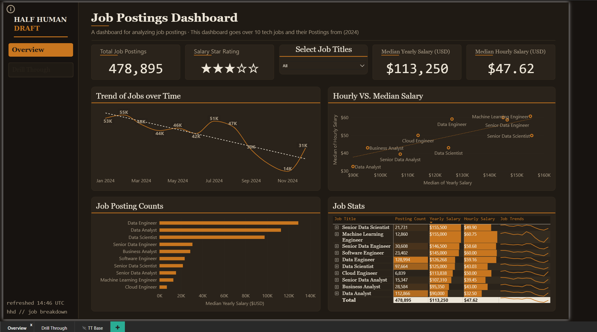

# Data and Analytics

End-to-end data work: ingestion, storage, service layers, and business-facing analysis.

---

## Job Postings Dashboard

A Power BI dashboard analyzing 478,895 tech job postings from 2024 across ten data and engineering roles: salary medians, demand trends, platform sources, and a per-role drill-through covering remote share, degree requirements, and benefits.

- **Repo:** https://github.com/Spendry/job-postings-dashboard
- **Shows:** BI report design, drill-through and bookmark navigation, and a custom theme.

## PoE Market Pipeline

A full pipeline that pulls market data from a game API, lands it in PostgreSQL, serves it through FastAPI, and surfaces it in Power BI over a secure tunnel.

- **Repo:** _add link_
- **Shows:** data engineering across the stack, API design, self-hosted BI delivery, and migration runbooks between hosts.

## Counting Accuracy Framework

A three-part probabilistic model that ties error probability to rework labor cost and throughput time, published as a formal document.

- **Repo:** _add link_
- **Shows:** applied statistics grounded in a real operations problem, and analysis a decision-maker can act on.

---

## A note on employer work

My production analytics work at a medical device employer stays private. It uses internal data and internal reporting standards, so it does not belong in a public repo. I can speak to the capability in an interview: demand forecasting reports, production attainment dashboards, refill-trigger boards, and a full data-estate mapping across curated and silver schemas, all built on a Databricks and Power BI stack.

If a reviewer wants proof of BI skill, point them at the PoE pipeline above. Same skills, shareable data.
